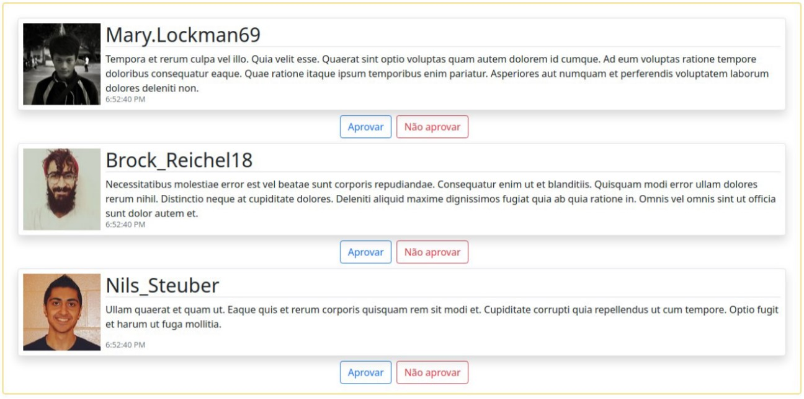
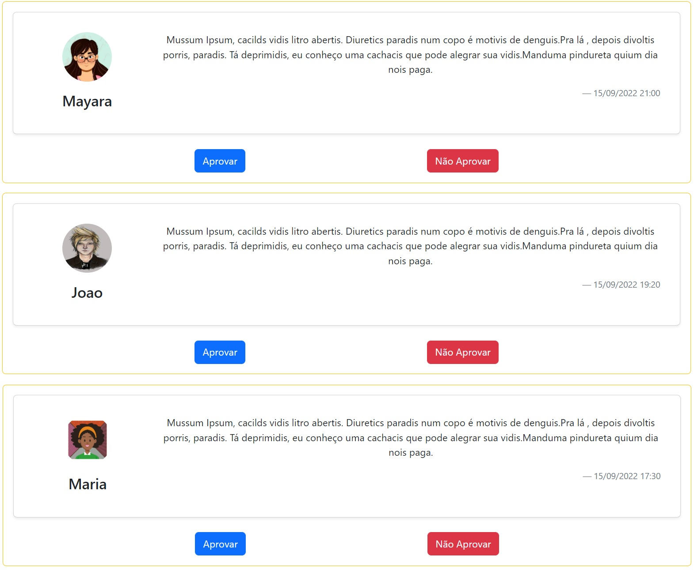

# Programação para Dispositivos Móveis
## 5º Semestre do curso de *Análise e Desenvolvimento de Sistemas*
# Exercício 2 - React - Props

Crie uma aplicação ReactJS que exibe uma lista de três comentários feitos por usuários de uma rede social. Ela pode ser parecida com o que exibe a Figura 1.1.

## As características desejadas são as seguintes:   
### 1.1 Cada comentário tem uma foto do usuário, data e hora de realização e texto.  
### 1.2 Cada comentário deve ser exibido como um “cartão”.
### 1.3 Cada comentário pode ser aprovado ou reprovado.  
### 1.4 A aplicação deve possuir os seguintes componentes ReactJS:
    - ListaComentarios – exibe   conteúdo   genérico,   especificado   por   meio   de   suapropriedade children. Seu conteúdo deverá ser uma coleção de três comentários.
    - Cartao – exibe  conteúdo genérico, especificado  por meio de sua  propriedadechildren. O conteúdo de um cartão deve ser um comentário e botões para feedback.
    - Comentario - Representa um comentário.
    - Feedback - Um   componente   que   exibe   dois   botões   para   o   usuário   dar   o   seufeedback.
#
# Resultado do exercício

